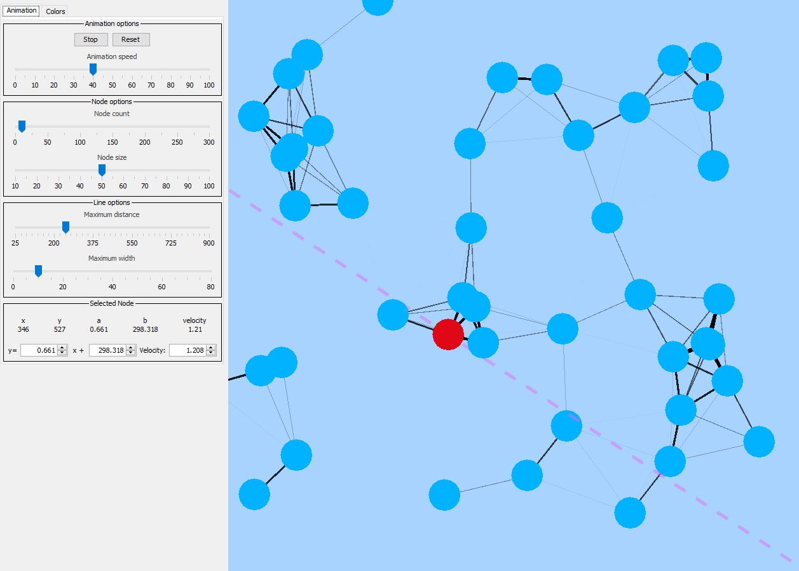

# A procedural-ish graph animation

    

A simple procedural animation with flying nodes that follow a linear path and connect to other nearby nodes. You can mess around with the parameters in real time.

    

## Options
- Animation speed
- Node count
- Node size
- Maximum distance for a node to be connected to another
- Connection maximum line width
- Individual node selection and modification:
  - Line equation change
  - Velocity

## Known issues
- The slope of the line equation is inverted
- Tends to run more slowly the more nodes and the larger maximum distance

## Setup
- Run the compiled .jar in releases or compile yourself with a java18 compatible compiler 

*Stay tuned for a 3D version (eventually)*